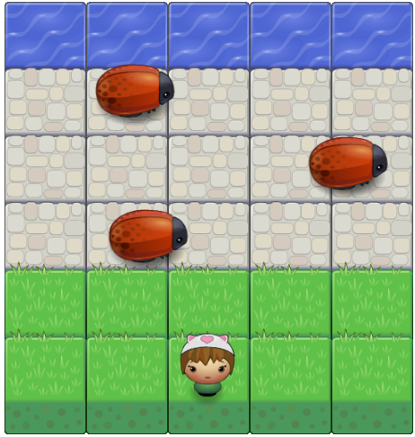

frontend-nanodegree-arcade-game
===============================

##Description:

Frogger is a classic video game which was introduced by Konami in 1981 as a one or two player game. The objective of the game is to move the frog from the bottom to the top and overcome obstacles that come your way.

##How to Play:

Use the arrow keys to move the player across the board. To win you need to reach water, but avoid colliding with the bugs.

##Enjoy it!  :smile:
